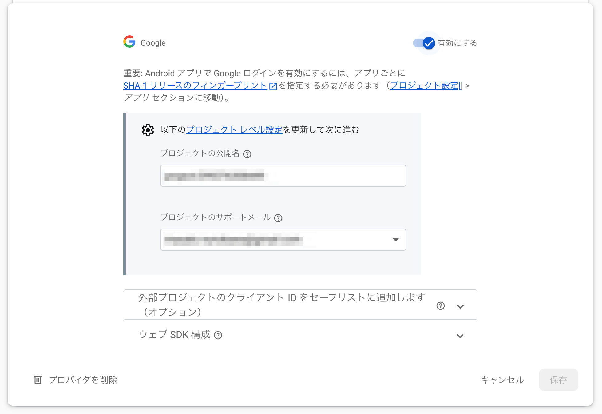
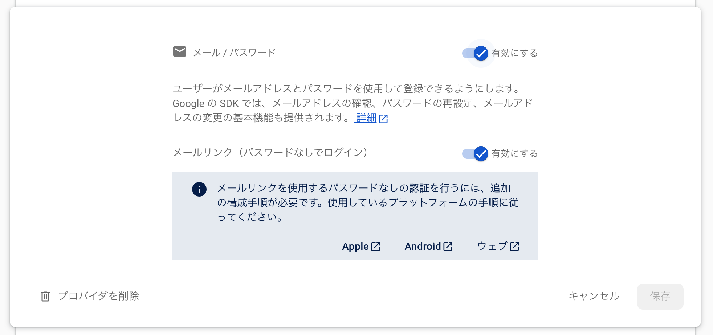

# Setup Firebase

## Firebaseプロジェクトを新規作成

### Authentication

#### 「新しいプロバイダを追加」→ Google



#### 「新しいプロバイダを追加」→ メール/パスワード



### Cloud Firestore

Cloud FireStoreを有効にする。

「ルール」タブを以下のように記述

```txt
rules_version = '2';

service cloud.firestore {
  match /databases/{database}/documents {
    match /users/{userId}/{document=**} {
      allow read, write: if request.auth != null && request.auth.uid == userId;
    }
  }
}
```

## プロジェクトの設定

「マイアプリ / アプリの追加」で Androidを選択

- Androidパッケージ名
- デバッグ署名SHA-1 (`keytool -list -v -keystore ~/.android/debug.keystore -alias androiddebugkey`
  を実行して取得)
- アプリを登録し、google-services.jsonをダウンロード
- Android Studioのプロジェクトの app/ フォルダに google-services.json を配置
